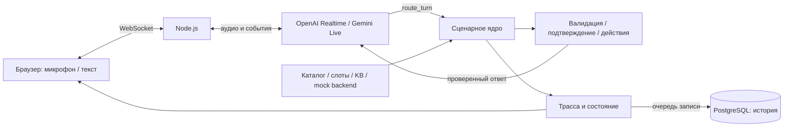

# Voice Router — HackAlem AI · Кейс Halyk Bank

**Команда doter · Кейс 2: гибридный голосовой AI-робот с LLM-выбором сценария.**

**[Открыть живое демо](https://hackalem.s-madaminov.tech)** · [Соответствие кейсу](docs/CASE_COMPLIANCE.md) · [Проверки](docs/VERIFICATION.md)

Демо открывается без регистрации. Для локальной проверки жюри в приватный репозиторий включён `.env.jury` с готовыми ключами: свои API-аккаунты не нужны.

Voice Router превращает разговор на русском, қазақша или смешанном языке в проверяемый сценарий обслуживания. Клиент говорит и слышит ответ, а супервизор видит транскрипт, решение LLM, краткое объяснение, альтернативы, действия и задержки. Перед изменением данных сервер запрашивает отдельное подтверждение.

Это прототип для кейса Halyk Bank на HackAlem AI. **Предметные сценарии сохранены из вымышленного страхового датасета организаторов**: банковские продукты и факты к нему не добавлялись. Все клиентские данные учебные; приложение не выполняет реальные платежи, SMS или страховые операции.

## Локальный запуск — одна команда

**Нужно:** Git, запущенный Docker Engine / Docker Desktop с Compose v2 и доступ в интернет. На Windows в Docker Desktop выберите Linux containers. Для голоса нужен современный браузер с микрофоном.

Клонируйте репозиторий под GitHub-аккаунтом, которому организаторы выдали доступ:

```sh
git clone https://github.com/BAITC-Hacks/hack-c5d95581-doter.git
cd hack-c5d95581-doter
```

Из корня проекта запустите **приложение и PostgreSQL одной командой** — она одинакова в PowerShell, macOS и Linux:

```sh
docker compose --env-file .env.jury up --build -d --wait
```

После успешного завершения откройте **http://localhost:3000/**. Первый запуск скачивает образы и зависимости; `--wait` ждёт готовности приложения и БД. Включённая конфигурация уже содержит ключи OpenAI и Gemini для проверки жюри. Ключи передаются серверу при запуске, исключены из Docker-образа и не отправляются браузеру.

Выберите провайдера и модель → **«Начать разговор»** → разрешите микрофон. В шумном помещении используйте **«Без микрофона»**: текстовый ввод сохраняет голосовой ответ, маршрутизацию и вызовы инструментов. Для удалённого адреса нужен HTTPS; localhost подходит для локального микрофона.

**Проверка готовности:** откройте http://localhost:3000/api/health — ожидаются `status: "ok"` и готовое PostgreSQL-хранилище. История переживает перезапуск, поскольку хранится в Docker volume. Порт базы не опубликован на хосте.

```sh
# Состояние контейнеров
docker compose --env-file .env.jury ps

# Остановка с сохранением истории
docker compose --env-file .env.jury down
```

Не добавляйте `-v`, если нужна история: этот флаг удаляет volume. Пароль БД в комплектной конфигурации предназначен для изолированного локального демо. Развёртывание на VPS с HTTPS описано в [deployment/README.md](deployment/README.md).

<details>
<summary><strong>Свои ключи или запуск без Docker</strong></summary>

Для собственных ключей создайте `.env` из [.env.example](.env.example):

```powershell
# Windows PowerShell
Copy-Item .env.example .env
```

```sh
# macOS / Linux
cp .env.example .env
```

Заполните `OPENAI_API_KEY` и/или `GEMINI_API_KEY`, затем выполните `docker compose up --build -d --wait`. Compose настроит PostgreSQL автоматически.

**Без Docker:** установите Node.js 24, затем из корня клона:

```sh
npm ci
node --env-file=.env.jury server.mjs
```

Для своей `.env` используйте `npm start`. Без `DATABASE_URL` история хранится только в памяти — интерфейс явно отмечает это. Для постоянной истории укажите PostgreSQL connection string. Ошибка настроенной БД останавливает старт, а не подменяет её временной памятью.

| Переменная | Назначение |
|---|---|
| `OPENAI_API_KEY` / `GEMINI_API_KEY` | Ключ выбранного Live API, только на сервере |
| `OPENAI_REALTIME_MODEL` | Начальный выбор OpenAI; по умолчанию `gpt-realtime-2.1` |
| `GEMINI_LIVE_MODEL` | Проверенная Live-модель `gemini-3.8-live` |
| `DATABASE_URL` | PostgreSQL для Node-запуска; Compose задаёт автоматически |
| `POSTGRES_PASSWORD` | Пароль PostgreSQL в Compose; используйте URL-safe символы |
| `PORT` / `HOST` | Порт и адрес Node-сервера; по умолчанию `3000` / `127.0.0.1` |

</details>

<details>
<summary><strong>Если запуск не удался</strong></summary>

| Симптом | Что проверить |
|---|---|
| Нет соединения с Docker daemon | Запустите Docker Desktop / Engine; на Windows — Linux containers |
| Порт 3000 занят | Измените `PORT` в используемом env-файле, повторите запуск и откройте новый порт |
| Микрофон недоступен | Разрешите доступ в браузере; используйте localhost или HTTPS; доступен режим «Без микрофона» |
| Ошибка Live API | Посмотрите сообщение в интерфейсе, попробуйте второй провайдер; доступность зависит от квоты API |
| Контейнер не готов | `docker compose --env-file .env.jury logs --tail=60 app postgres` |

</details>

## Демонстрация для жюри

1. **Голос и знания:** «Где находится офис в Алматы?» — адрес и часы берутся из KB; рядом появляется `SC33` и результат `get_offices`.
2. **Контекст и смена языка:** «Ал Астанада ше?» — город меняется, тема сохраняется, ответ переходит на казахский.
3. **Несколько намерений:** «Хочу продлить полис и узнать про КАСКО» — видны активная тема и очередь; незавершённая тема сохраняется при переключении.
4. **Точный поиск факта:** «Объясните, что не покрывает КАСКО» — `SC40` выбирает исключения и показывает путь к факту в KB. Если нужного сведения нет, ассистент уточняет или сообщает об отсутствии данных.
5. **Подтверждение действия:** попросите изменить контакт учебного клиента из [mock_backend.json](data/mock_backend.json). Проверьте предварительный просмотр; только отдельное «Да, подтверждаю» или кнопка разрешает действие. Повтор того же события не выполняет операцию снова.
6. **Прерывание и супервизор:** начните новую реплику во время ответа; проверьте остановку старого аудио. После **«Завершить»** откройте **«История последнего диалога»** — там сохраняются тексты, решения, действия и состояние. Проверенный ответ ядра и окончательный транскрипт озвучки хранятся отдельно.

**«Новый диалог»** создаёт новую копию учебного бэкенда. PostgreSQL сохраняет журнал предыдущего разговора, но не превращает учебные операции в общую CRM. История привязана к HttpOnly cookie браузера: одна ссылка не даёт доступ из другого браузера. Cookie действует 30 дней; запись в БД сама по себе не восстанавливает оборванное Live-соединение.

## Реализованные возможности

| Возможность | Реализация и границы |
|---|---|
| Нативный голос | OpenAI Realtime и Gemini Live, поток PCM, AudioWorklet, прерывания и защита от запоздалого аудио |
| LLM Router | 40 бизнес-сценариев + 3 системных намерения; RU/KK/mixed; несколько намерений, обоснование и альтернативы |
| Tool calling | `route_turn` → серверная валидация → разрешённые действия из каталога; модель не исполняет операции напрямую |
| Состояние разговора | Слоты по сценариям, активная тема, очередь, прерванные темы, продолжение и подтверждения |
| Grounding / поиск знаний | Структурированный поиск по продукту и теме, ссылки на выбранные поля KB, честный `not_found`; embeddings и векторной БД нет |
| Системный промпт | Правила маршрутизации, язык, контекст, границы сценариев, фиксированная дата, запрет выдуманных фактов и преждевременных действий |
| Супервизор | Диалог, маршруты, уверенность, объяснение, альтернативы, слоты, действия и измеренные задержки |
| Постоянная БД | PostgreSQL: сессии, реплики, результаты инструментов, состояние и задержки; аудио не хранится |
| Передача оператору | Симуляция с единым контекстом: причина, просьба, темы, слоты, последнее действие и статус подтверждения |
| Воспроизводимость | Docker Compose, локальные тесты, оригинальный оценщик и опубликованный результат dev-прогона |

Полная привязка к требованиям — [матрица соответствия](docs/CASE_COMPLIANCE.md); выполненные проверки — [журнал верификации](docs/VERIFICATION.md). Все 40 маршрутов подключены к серверному ядру; отсутствие календаря или нужного правила приводит к уточнению/оператору, а не к выдуманному успеху операции.

## Архитектура



LLM выбирает сценарий по описаниям и границам каталога. Размеченные dev-реплики не входят в runtime prompt; таблицы ответов и encoder intent classifier нет. Внутри уже выбранного информационного сценария сервер выбирает конкретные факты из JSON KB — это отдельная операция, не подмена LLM-маршрутизации.

Сервер проверяет значения слотов, принадлежность полисов и правила расчётов. Необратимое mock-действие проходит preview и отдельное подтверждение конкретных аргументов. Смена аргументов требует нового preview; повторная доставка одного хода не создаёт повторную операцию.

Промпт разделяет роль, вызов инструмента, маршрутизацию, источники фактов и подтверждения; сверено с официальными [OpenAI Realtime prompting](https://developers.openai.com/api/docs/guides/voice-prompting) и [Gemini Live best practices](https://ai.google.dev/gemini-api/docs/live-api/best-practices).

Аудио ответа пропускается только после результата `route_turn`. Модели предписано озвучивать проверенный ответ без добавлений; эта инструкция не является формальным доказательством побуквенного совпадения речи. При прерывании старое воспроизведение очищается, поздние события прежнего хода отбрасываются.

Стек: **Node.js 24, `ws`, `pg`, PostgreSQL 17, HTML/CSS/JavaScript, Web Audio / AudioWorklet**. Сборщика и UI-фреймворка нет. Noto Sans хранится локально с лицензией OFL; внешних CDN-запросов нет. История записывается отдельно от критического пути голосового ответа; ошибка записи показывается пользователю. Учебные предметные данные изолированы в памяти каждой сессии.

## Данные и внешние сервисы

| Источник | Как используется |
|---|---|
| `data/scenarios.json`, `slots.json`, `actions.json` | 40 исходных сценариев, границы, параметры и разрешённые действия |
| `data/knowledge_base.json`, `mock_backend.json` | Факты вымышленной компании и синтетические клиенты; источник ответов и учебных операций |
| `evaluation/dev_utterances.json`, `dialogs_sample.json`, `evaluate.py` | 104 размеченные реплики, 10 диалогов и оригинальный оценщик; эталонные ответы не передаются runtime LLM |
| OpenAI Realtime / Gemini Live | Внешний выбранный Live API получает аудио или текст, каталог, контекст и результаты инструментов; выполняет маршрутизацию и синтез речи |
| PostgreSQL | Журнал диалогов и действий; Compose запускает собственную БД, внешний managed-сервис не требуется |

В демо используются только данные организаторов и синтетический ввод. Отдельные STT/TTS API, embeddings, векторная БД, CRM и банковские сервисы не подключены. Клиентский звук не сохраняется приложением.

## Выбор провайдера и модели

OpenAI показывает разговорные Realtime-модели из каталога аккаунта. Все варианты остаются доступными в селекторе. Метки описывают проверенный профиль точного model ID; неизвестным моделям не приписываются цена или качество по названию.

| Модель | Рекомендация | Аудио: вход / выход, USD за 1 млн токенов |
|---|---|---:|
| `gpt-realtime-2.1` | Приоритет качества внутри линейки OpenAI; начальный выбор | 32 / 64 |
| `gpt-realtime-2.1-mini` | Экономнее внутри OpenAI; проверить сложные сценарии отдельно | 10 / 20 |
| `gemini-3.8-live` | Ниже ставки аудио, чем у полной Realtime 2.1 | 3 / 12 |

Тарифы проверены **23.09.2026** по официальным [OpenAI model docs](https://developers.openai.com/api/docs/models/gpt-realtime-2.1), [Realtime 2.1 Mini](https://developers.openai.com/api/docs/models/gpt-realtime-2.1-mini) и [Google pricing](https://ai.google.dev/gemini-api/docs/pricing). Это ставки токенов, **не цена минуты разговора**: история, кэш, время прослушивания и транскрипция влияют на итог. Сравнительного теста качества OpenAI против Gemini не проводилось. Старые модели отмечены отдельно; их доступность в каталоге не гарантирует успешный вызов.

## Проверка и результаты

Локальные тесты без API-ключей и платных вызовов:

```sh
npm ci
npm test
```

Тесты покрывают сценарные расчёты, владение объектами, подтверждения, повтор операций, контекст, поиск знаний RU/KK, события Live API, прерывания, старое аудио, выбор модели, историю и изоляцию доступа. Для интеграционного теста настоящей БД задайте `HISTORY_TEST_DATABASE_URL`; без него этот тест явно пропускается.

Реальный прогон **OpenAI `gpt-realtime-2.1`** на всех **104 dev-репликах**, 23.09.2026, с prompt ревизии `44b279c`:

| Метрика | Результат |
|---|---:|
| Основной сценарий | **103/104 — 99,04%** |
| Полное совпадение набора сценариев | **102/104 — 98,08%** |
| Полнота нескольких намерений | **100%** |
| RU: основной / полный | 52/52 · 52/52 |
| KK: основной / полный | 44/45 · 43/45 |
| Mixed: основной / полный | 7/7 · 7/7 |

[Предсказания](docs/evaluation-predictions.json) и [отчёт с метаданными](docs/evaluation-results.json) опубликованы без разговоров и секретов. Проверить арифметику оригинальным оценщиком можно без платного вызова:

```sh
python -X utf8 evaluation/evaluate.py docs/evaluation-predictions.json evaluation/dev_utterances.json
```

После этого прогона в prompt явно добавлено требование `product_type` для SC40, уже обязательное в ядре. При финальной проверке также уточнены дословная озвучка ответа инструмента, доступность только `route_turn` и работа с фоновым шумом. Полный показатель новой редакции ещё не измерен.

Остались расхождения `U040` (неясный запрос вместо оценки автомобиля) и `U044` (лишнее системное намерение). Это один сохранённый прогон отдельных текстовых реплик; он не доказывает качество всех диалогов, физического микрофона или скрытого набора жюри.

Для нового платного прогона с ключами из `.env`:

```sh
npm run evaluate -- --limit 10
npm run evaluate -- --all --resume
node --env-file=.env tools/smoke-audio.mjs openai
node --env-file=.env tools/smoke-audio.mjs gemini --reuse
```

`--resume` проверяет совпадение модели, prompt, схемы и набора. Эталон используется только при подсчёте результата. Ошибки API останавливают прогон, пропуски не заполняются выдуманными ответами. Свежие результаты остаются в gitignored `artifacts/`.

Оба провайдера прошли синтетический PCM → `route_turn` → ядро → голосовой ответ. В браузере проверены текстовые запросы с озвучкой, в том числе смена RU → KK и города в Gemini. Физический микрофон и акустическое перебивание требуют ручной проверки с устройством участника.

### Честные измерения задержки

| Метрика в интерфейсе | Что измеряется |
|---|---|
| Маршрутизация | Окончание речи по VAD / получение текста → вызов `route_turn` |
| Действия | Выполнение серверного ядра |
| До транскрипта | VAD → окончательная транскрипция; для текста — 0 |
| До голосового ответа | VAD / получение текста → уведомление браузера о начале воспроизведения |

Задержка воспроизведения включает передачу событий и не является акустическим измерением. Для нативных STT/TTS отдельных таймингов нет; недоступные значения показаны как «—». Gemini может не отдавать надёжную границу конца речи. Бонусные ориентиры 500 мс / 1,5 с **не заявляются как достигнутые**; для них нужен отдельный согласованный голосовой прогон и медиана по набору.

## Структура проекта

| Путь | Назначение |
|---|---|
| `public/` | Интерфейс, микрофон, проигрывание PCM, просмотр истории |
| `server.mjs` | HTTP/WebSocket, сессии, тайминги, доступ к истории |
| `lib/providers.mjs` | Адаптеры OpenAI и Gemini |
| `lib/prompts.mjs` | Системные инструкции и схема `route_turn` |
| `lib/engine.mjs`, `lib/knowledge.mjs` | Состояние, действия, подтверждения, поиск фактов |
| `lib/history.mjs` | PostgreSQL и ограниченное временное хранилище |
| `lib/model-guidance.mjs` | Проверенные рекомендации и источники |
| `data/` | Неизменённые исходные данные организаторов |
| `evaluation/` | 104 dev-реплики, 10 примеров диалогов, оригинальный оценщик |
| `tests/`, `tools/`, `docs/` | Регрессии, API-проверки, соответствие кейсу и результаты |

## Границы и развитие

- CRM, телефония, платежи, SMS и календарь не подключены. Моки поверх JSON предусмотрены набором кейса. Поддерживаемые изменения применяются только к копии данных текущего диалога.
- PostgreSQL сохраняет журнал, а не общую предметную CRM. Восстановления активного разговора после разрыва и семантического vector RAG пока нет.
- В KB нет всех возможных определений и правил. В таких случаях нужен уточняющий вопрос или оператор; модель не дополняет базу догадками.
- Для коммерческой эксплуатации понадобятся роли пользователей, политика хранения/удаления, аудит доступа, ограничения нагрузки и реальные интеграции. Демонстрационный доступ по cookie не заменяет полноценную учётную запись.
- Следующие шаги: измерение на реальных RU/KK разговорах, контролируемое расширение KB, production CRM/телефония и сравнение моделей на одинаковом наборе.

Данные и критерии — [README организаторов](data/README.ru.md). Интеграции — официальные [OpenAI Realtime](https://developers.openai.com/api/docs/guides/realtime) и [Gemini Live](https://ai.google.dev/gemini-api/docs/live-api). За проект отвечает команда **doter**; вопросы и воспроизводимые ошибки можно оставить в Issues этого репозитория.

**Сдача:** push в GitHub не заменяет отправку решения на платформе хакатона. Участнику нужно отдельно подать репозиторий и демонстрацию на странице кейса.
