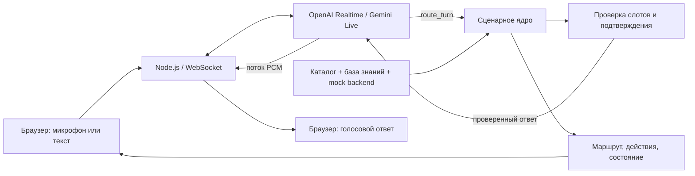

# Voice Router — команда doter

Голосовой ассистент для контакт-центра **Saqta Insurance**, кейс 2 хакатона **HackAlem AI**. Клиент говорит по-русски, қазақша или смешивает языки; Live-модель выбирает сценарии, а сервер проверяет данные и выполняет действия в учебном бэкенде. Супервизор видит диалог, выбранные маршруты, объяснение, альтернативы и фактические результаты.

Реализованы **40 бизнес-сценариев и 3 системных намерения**, браузерный голосовой и резервный текстовый ввод, OpenAI Realtime и Gemini Live. Все данные компании и клиентов синтетические. Фиксированная дата набора — **1 октября 2026 года**.

## Быстрый запуск

Нужны **Node.js 24**, npm, доступ к API выбранного провайдера и браузер с AudioWorklet/Web Audio. Ключи хранятся на сервере.

```sh
npm ci
```

Скопируйте `.env.example` в `.env` и заполните хотя бы один ключ:

```dotenv
OPENAI_API_KEY=
GEMINI_API_KEY=
OPENAI_REALTIME_MODEL=gpt-realtime-2.1
GEMINI_LIVE_MODEL=gemini-3.8-live
PORT=3000
HOST=127.0.0.1
```

Запуск приложения одной командой:

```sh
npm start
```

Откройте **http://127.0.0.1:3000/**. Выберите провайдера и модель, нажмите **«Начать разговор»** и разрешите микрофон. Для текста нажмите **«Без микрофона»**: ответ всё равно озвучивается. На удалённом адресе микрофону требуется HTTPS; локальный сервер по умолчанию слушает только `127.0.0.1`.

В списке OpenAI отображаются разговорные Realtime-модели из каталога аккаунта. Текущий стартовый выбор — `gpt-realtime-2.1`; его можно сменить до подключения. Каталог не гарантирует доступность каждой модели для конкретного запроса: ошибка подключения показывается в интерфейсе. Для Google используется проверенный идентификатор **`gemini-3.8-live`**. При недоступности каталога сохраняется модель из `.env` с отметкой об отсутствии проверки.

`.env`, аудиофайлы проверки и результаты оценки исключены из Git. Секреты не передаются клиентскому JavaScript. В учебном демо используйте только синтетические данные: аудио и текст разговора отправляются выбранному облачному провайдеру.

## Что попробовать

1. **Информационный запрос:** «Где находится офис в Алматы?» Ответ использует адрес и часы из базы знаний.
2. **Казахский язык:** «Сәлеметсіз бе, Алматыда кеңселеріңіз қайда орналасқан?»
3. **Несколько намерений:** «Хочу продлить полис и узнать про КАСКО». В панели видны активный сценарий и очередь.
4. **Смена темы:** задайте вопрос о полисе, затем спросите об офисе. Незавершённая тема сохраняется отдельно от новой.
5. **Подтверждение:** попросите изменить контакт учебного клиента из `data/mock_backend.json`. Сначала появляются параметры действия; изменение выполняется только после отдельного явного подтверждения. Кнопка подтверждения и голосовое «Да, подтверждаю» проходят через один серверный путь.
6. **Прерывание:** начните новую реплику во время ответа. Старое воспроизведение останавливается, запоздалые фрагменты старой реплики отбрасываются.

**«Новый диалог»** закрывает соединение и создаёт чистое состояние, включая новую копию учебного бэкенда. **«Завершить»** останавливает подключение и микрофон. Переводы оператору, SMS, платежи и изменения полисов в демо моделируются — реальные операции не выполняются.

## Как устроено



- **LLM выбирает сценарии.** В запрос входят описания, границы сценариев и схемы параметров. Размеченные проверочные реплики в рабочий prompt не передаются. Энкодерного классификатора и таблицы соответствия тестовых фраз нет.
- **Сервер контролирует факты и действия.** `lib/engine.mjs` хранит активную тему, очередь и прерванные темы; проверяет слоты, принадлежность полисов, правила расчётов и аргументы операций.
- **Подтверждение привязано к конкретной операции.** Новый аргумент требует нового предварительного просмотра. Смена темы отменяет ожидание подтверждения; повторная доставка одного хода не выполняет действие снова. Новая самостоятельная операция получает собственный идентификатор.
- **Голос нативный.** Live API обрабатывает входное аудио и возвращает речь. AudioWorklet переводит микрофонный поток в PCM16: 24 кГц для OpenAI и 16 кГц для Gemini; воспроизведение — 24 кГц. Отдельные STT/TTS-сервисы не требуются.
- **Ответ проходит через инструмент.** Аудио модели блокируется до результата `route_turn`. Модели предписано озвучивать проверенный ответ без дополнений; это инструкция модели, а не формальное доказательство неизменности каждого слова.
- **Минимальный стек:** Node.js, `ws`, HTML/CSS/JavaScript без сборщика, UI-фреймворка, внешних шрифтов или базы данных. Сервер отдаёт только `public/`; отдельный бэкенд учебных данных создаётся на каждую сессию.

## Трассировка и задержки

После реплики панель показывает сценарии, оценку уверенности модели, краткое обоснование на основе слов клиента, альтернативы, извлечённые данные и результаты действий. Уверенность — оценка модели, она не откалибрована как вероятность.

Измерения основаны на наблюдаемых событиях:

| Метрика | Граница измерения |
|---|---|
| Маршрутизация | Окончание речи по серверному VAD / получение текста → вызов инструмента маршрутизации |
| Выполнение действий | Обработка решения серверным ядром |
| До транскрипта | Окончание речи по VAD → окончательный транскрипт; для текста — 0 |
| До голосового ответа | VAD / получение текста → уведомление браузера о начале воспроизведения |

Последняя метрика включает доставку событий и не является акустическим замером у микрофона. Для Gemini при отсутствии надёжного события окончания входной речи соответствующие значения показаны как **«—»**. Отдельные задержки встроенных STT и TTS недоступны и не подменяются нулями. Бонусные ориентиры 500 мс / 1,5 с не заявляются как достигнутые.

## Проверка

Локальные проверки без API-ключей и платных запросов:

```sh
npm test
```

Проверено **52/52 теста**. Они покрывают расчёты и владение объектами, подтверждение и повтор операций, переключение тем, обработку событий провайдеров, прерывания, устаревшее аудио, изоляцию приватных файлов, WebSocket origin, выбор модели и окончание микрофонного потока.

Реальные API-проверки используют ключи из `.env` и расходуют квоту провайдера:

```sh
node --env-file=.env tools/list-models.mjs
node --env-file=.env tools/smoke-live.mjs openai
node --env-file=.env tools/smoke-live.mjs gemini
npm run evaluate -- --limit 10
npm run evaluate -- --all --resume
```

Оценщик получает настоящие предсказания Live-модели и сохраняет их в `artifacts/predictions.json`. Каждая проверочная реплика отправляется в отдельной сессии; эталон используется только при подсчёте метрик. `--resume` допускается только при совпадении модели, prompt, схемы инструмента и набора данных. Ошибка API останавливает прогон; пропущенные ответы не заменяются выдуманными предсказаниями.

Оригинальный оценщик организаторов доступен при установленном Python:

```sh
python -X utf8 evaluation/evaluate.py artifacts/predictions.json evaluation/dev_utterances.json
```

Оценка отдельных текстовых реплик не заменяет проверку многошаговых разговоров, голоса, микрофона и скрытого набора жюри.

## Проверенные результаты — 23 сентября 2026

Реальный прогон **OpenAI `gpt-realtime-2.1`** по всем 104 dev-репликам; метрики подтверждены оригинальным `evaluation/evaluate.py`:

| Метрика | Результат |
|---|---:|
| Правильный основной сценарий | **103 / 104 — 99,04%** |
| Полное совпадение набора сценариев | **102 / 104 — 98,08%** |
| Полнота нескольких намерений | **100%** |
| Русский: основной сценарий / полное совпадение | 52 / 52 · 52 / 52 |
| Казахский: основной сценарий / полное совпадение | 44 / 45 · 43 / 45 |
| Смешанная речь: основной / полное совпадение | 7 / 7 · 7 / 7 |

Остались два расхождения на казахском: запрос на оценку автомобиля классифицирован как неясный (`U040`); к проверке покрытия ДМС добавлено лишнее системное намерение (`U044`). Это один воспроизводимый сохранённый прогон, а не гарантия результата повторных вызовов или скрытого набора.

OpenAI и Gemini прошли полный путь с **синтетическим аудиовходом**, вызовом сценарного ядра и голосовым ответом. В этом коротком тесте первый полученный PCM пришёл примерно через 2,16 с у OpenAI после вызова endAudio и 2,04 с у Gemini после audioStreamEnd, которому предшествовали 800 мс тестовой тишины; это **не** время начала воспроизведения в браузере и **не** сравнение производительности моделей. Для завершения обрываемого потока Gemini используется короткий участок тишины перед `audioStreamEnd`.

В браузере отдельно проверен казахский текстовый запрос OpenAI с голосовым ответом, маршрутом и уведомлением о начале воспроизведения. Адаптивная компоновка проверена на широком и узком экранах. Физический микрофон пользователя и акустический barge-in остаются ручной проверкой.

Синтетический голосовой smoke можно воспроизвести:

```sh
node --env-file=.env tools/smoke-audio.mjs openai
node --env-file=.env tools/smoke-audio.mjs gemini --reuse
```

Первый запуск создаёт короткий синтетический PCM-образец; второй использует его же. Файлы с результатами и образцом сохраняются только в `artifacts/`.
## Данные и файлы

| Каталог / файл | Назначение |
|---|---|
| `public/` | Интерфейс, микрофонный AudioWorklet, воспроизведение PCM |
| `server.mjs` | HTTP, WebSocket, сессии, измерение задержек |
| `lib/providers.mjs` | Адаптеры нативных Live API |
| `lib/prompts.mjs` | Контракт `route_turn` и инструкции маршрутизации |
| `lib/engine.mjs` | Сценарное состояние и проверяемые mock-действия |
| `data/` | Неизменённые JSON организаторов: сценарии, слоты, действия, знания, бэкенд |
| `evaluation/` | 104 dev-реплики, 10 диалогов, оценщик организаторов |
| `tests/` | Локальные автоматические проверки |
| `tools/` | Проверка моделей и реальные прогоны API |
| `artifacts/` | Локальные результаты; не публикуются |

## Границы демо

- Учебный бэкенд хранится в памяти. Перезапуск/новая сессия сбрасывает изменения; реальной CRM, телефонии, платежей и SMS нет.
- Идентификация по синтетическим данным демонстрационная. Публичный production-доступ потребует полноценной аутентификации, ограничений частоты, защищённого хранения и управления данными.
- Для изменения условий полиса и записи без доступного календаря предусмотрен перевод оператору. Неизвестная зона путешествия или неоднозначные условия требуют уточнения, а не выдуманных правил.
- Микрофон зависит от разрешения браузера, устройства и акустики. Автоматическая проверка синтетическим аудио не доказывает качество реального микрофона, шумоустойчивость или качество всех RU/KK голосов.
- Нативные голосовые модели могут ошибаться в транскрипции и выборе маршрута. Сервер проверяет параметры и действия, но не превращает вероятностную модель в безошибочный классификатор.
- Отправка в GitHub не означает сдачу на платформе хакатона: решение необходимо отдельно подать на странице кейса.

Интеграции основаны на официальной документации [OpenAI Realtime](https://developers.openai.com/api/docs/guides/realtime) и [Gemini Live](https://ai.google.dev/gemini-api/docs/live-api). Данные и критерии проверки предоставлены организаторами HackAlem AI.
